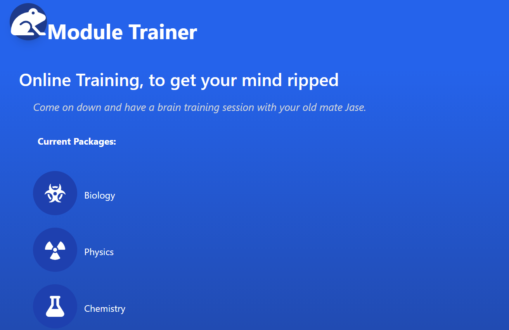
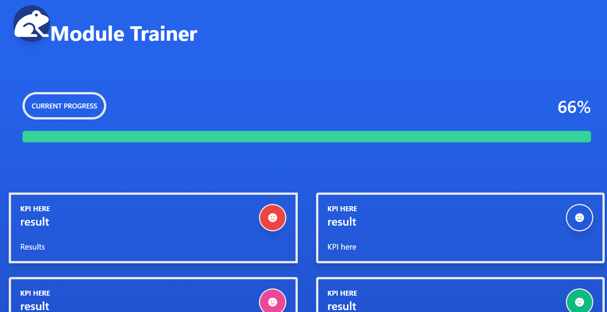
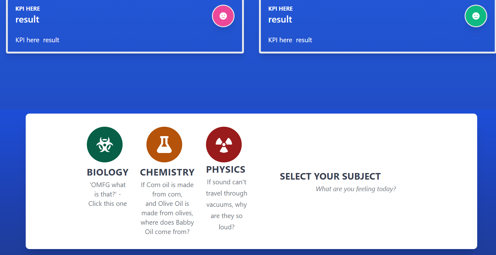
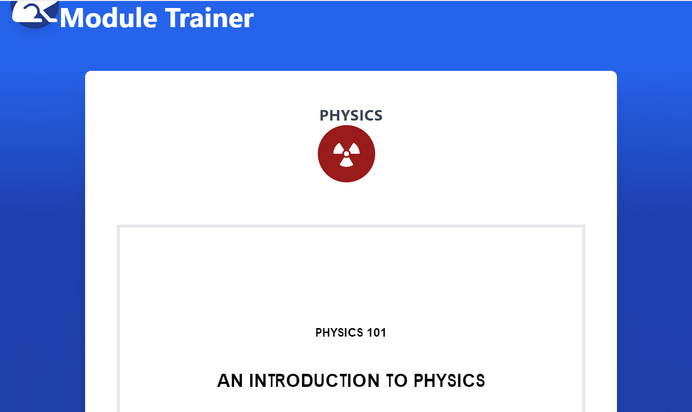

# Module-trainer-

A MERN stack application that allows you to install modules and train users on different areas.
## Description & LIVE DEPLOYED WEBSITE
---
You can find the app here [here](https://module-trainer100.herokuapp.com/).  For more information see below. 

What currently works:
 - Login and Register both work with JWT
 - Viewing courses and selecting pages for PDF
 - Viewing dashboard

What's still in progress:
 - Sign in page will not work 
 - Progress bar is not working
  - different KPI indicators are still being adjusted
  

Future Developments:
 - Adding different training modules for different areas
 - Adding difficulties for different courses

## Screenshots
---
Landing Page

Dashboard top

Dashbord bottom

Course Page 

## Tools & Technologies
---
    - Tailwind CSS
    - MERN stack using MongoDB, ExpressJS, ReactJS, and nodeJS
    - Apollo and GraphQL
    - JWT 

## Installation 
---
Only npm i should be needed

## Questions?
---
Please send any questions to [email](mailto:jasonbolton89@gmail.com). 

You can find my Github here
- [Github] -(https://github.com/jbolton89) [module trainer](https://github.com/Jbolton89/Module-trainer-). 

The app can be viewed live [here](https://module-trainer100.herokuapp.com/)